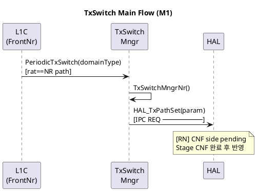

# 5.2 Code Analyzer — Track A: Staged MSC 생성 프롬프트 v1.2

- **Version:** v1.2 (§0 3-file 관계 및 명칭 정리)
- **Updated:** 2026-06-18 (KST)
- **Track:** A — staged-code-analyzer 스킬 기반 메인 분석
- **Related Skill:** `staged-code-analyzer`

---

## 0. 이 문서의 위치 — prompt/ 폴더 내 5.2 관련 3개 파일

`L1a/prompt/`에는 5.2 Code Analyzer 관련 파일이 3개 있다. **2개(신규) + 1개(구세대, 별도 계열)** 구조이며, "Track A/B" 명칭은 신규 2개 페어에만 쓴다.

| 파일 | 계열 | 방식 | 상태 |
|---|---|---|---|
| `5_2_code_analyzer_py_package_prompt.md` | **별도 계열** (Track 아님) | Python 패키지(`code_analyzer/`)를 빌드하라는 지시 — 파싱+HLD생성을 코드로 구현 | 기존, historical record로 보존 |
| `5_2_code_analyzer_track_b_prompt.md` | Track 페어 | bash(find/wc/ctags/grep) 정적 추출 → `structure.json` | 신규, Track A의 선택적 선행 단계 |
| `5_2_code_analyzer_track_a_prompt.md` (본 문서) | Track 페어 | staged-code-analyzer 스킬로 Claude가 직접 단계별 MSC 생성 | 신규, 메인 실행 경로 |

py_package 파일은 Track B와 무관하다. **분석 로직을 Python 코드로 구현**하는 접근이고, Track B는 **분석 로직 없이 bash로 구조만 추출**해 Claude(Track A)에 넘기는 접근이라 설계 자체가 다르다. "Track" 번호는 신규 페어 전용 명칭으로, py_package 파일을 가리킬 때는 쓰지 않는다.

```
Track B (선택, 선행)   5_2_code_analyzer_track_b_prompt.md
  → structure.json
        ↓
Track A (본 문서)      5_2_code_analyzer_track_a_prompt.md
  → Phase 0 (계획) → Phase 1..N (모듈별 MSC) → Phase F (통합)
```

Track B를 먼저 실행하면 Phase 0 토큰이 줄고 IPC REQ/CNF 지점이 미리
특정되어 MSC 구성이 빨라진다. Track B 없이 Track A만 실행해도 동작한다.

---

## 1. 목적

HLD 없이 코드만 존재하는 방대한 L1 C++ 폴더를, 단계별로:
1. 모듈별 **MSC (PlantUML)** — 메인 산출물
2. **Brief module intro** — 책임 1–2줄, entry point, 주요 IPC 호출
3. **Call graph (structure.json)** — Track B 산출물 또는 Phase 0에서 생성

전체 HLD 초안 / update_items 생성은 5.2 범위 밖 (5.4 Code-HLD Consistency에서 처리).

---

## 2. 선행 전제

```text
- Claude Code 설치 및 사용 가능
- staged-code-analyzer 스킬 설치:
    %USERPROFILE%\.claude\skills\staged-code-analyzer\SKILL.md
- api-callflow-analysis / plantuml-msc / common 스킬 설치
- (선택) Track B 완료 → structure.json 경로 준비
```

설치 확인:
```powershell
Test-Path "$env:USERPROFILE\.claude\skills\staged-code-analyzer\SKILL.md"
```

---

## 3. 공통 설계 원칙

`prompt/5_0_common_automation_framework.md` 단일 출처 참조.

분석 정책은 `staged-code-analyzer` 스킬이 소유. 본 프롬프트는 소비만 함. (§5.0.10)

---

## 4. 사용 스킬

```text
staged-code-analyzer  ← 오케스트레이션 (Phase 0/1..N/F, 체크포인트, carry)
  ├─ api-callflow-analysis  ← 모듈별 confirmed call flow
  ├─ plantuml-msc           ← MSC 생성 (PRIMARY)
  └─ (hld 스킬)             ← brief intro의 책임/인터페이스 필드만 참조
common                ← 공통 원칙
```

---

## 5. 입력값

```text
- 코드 루트 경로
- 분석 확장자 (.c .cpp .h .hpp)
- 제외 폴더 (test/ third_party/ build/)
- target slug (선택)
- structure.json 경로 (Track B 실행 후, 선택)
```

---

## 6. 출력값

```text
모듈별:
  callflow_<module>_<ts>.puml       ← MSC (primary)
  module_intro_<module>_<ts>.md     ← brief intro (secondary)

Phase F 통합:
  callflow_<slug>_toplevel_<ts>.puml
  module_index_<slug>_<ts>.md
```

---

## 7. Artifact 규칙 (§5.0.8)

```text
%USERPROFILE%\artifacts\code_analyzer\<slug>\
├── analysis_progress.md
└── run_<YYYYMMDD_HHMM_KST>\
    ├── callflow_<module>_<ts>.puml
    ├── module_intro_<module>_<ts>.md
    ├── callflow_<slug>_toplevel_<ts>.puml
    └── module_index_<slug>_<ts>.md
```

---

## 8. AI 실행 지시 프롬프트

### Step 0 — 단계 계획

```text
staged-code-analyzer 스킬로 <코드루트경로> 의 MSC 작성 단계 계획을 세워줘.

[입력]
- 코드 루트: <코드루트경로>
- 분석 확장자: .c .cpp .h .hpp
- 제외 폴더: <test/ build/ 등>
- target slug: <선택>
- structure.json: <경로 또는 "없음">

[조건]
1. Phase 0만 수행. 파일 트리/크기/시그니처를 보고 Stage Plan만 만들어줘.
   structure.json 있으면 그것을 우선 참고 (소스 직접 read 최소화).
2. Stage 순서: (1)entry point/public API 모듈 (2)CNF 핸들러 파일
   (3)feature 분기 ENDC/ULCA/Dual SIM (4)helper.
3. IPC REQ 지점들과 CNF 핸들러(파일 하나)를 목록화하고,
   CNF를 어느 Stage에서 분석할지 명시해줘.
4. Stage당 ≤ 6 파일 또는 ≤ 1,500 LOC.
5. 계획만 보여주고 멈춰. 첫 Stage는 내가 고를게.
```

### Step 1..N — 모듈별 분석

```text
analysis_progress.md 를 먼저 읽고, 다음 Stage 하나만 분석해줘.

[조건]
1. 이번 Stage 파일 + 열려있는 [CARRY] Open Call Boundary만 대상.
   structure.json 있으면 이번 모듈 슬라이스를 참고.
2. api-callflow-analysis 스킬로 entry point부터 callee-side call flow를
   HAL/PHY/IPC REQ boundary까지 추출. 미확인은 [RN].
3. IPC REQ 지점을 CNF 핸들러와 연결:
   - Global CNF Carry RESOLVED면 CNF 우측을 MSC에 포함
   - PENDING이면 MSC에 "[RN] CNF side pending" 표시
4. plantuml-msc 스킬로 MSC 생성 (메인 산출물):
   - 좌측: entry → call chain → IPC REQ (경계 표시)
   - 우측: IPC CNF (경계) → RrcTxPathCnf → domainType 분기
5. Brief module intro (3–5줄 max): 책임, entry point, IPC REQ 호출, domainType 감응 여부.
6. 산출물 2종(callflow.puml / module_intro.md)을 run 폴더에 timestamp로 저장.
7. analysis_progress.md 갱신 (DONE, confirmed edges, CNF carry status, 다음 Stage) 후 멈춰.
```

**CNF Stage 전용 추가 조건**:
```text
(CNF 핸들러 Stage에서는 아래를 추가)
- CNF 파일 body를 targeted read (이 파일 한 번만 읽으면 됨)
- domainType 분기별 callee 함수, timer/callback entry 추출
- Global CNF Carry를 RESOLVED로 갱신
- 이후 모든 Stage는 이 결과를 재사용 (CNF 파일 재read 금지)
```

### 이어하기 (다른 세션)

```text
analysis_progress.md 를 읽고 DONE이 아닌 첫 Stage부터 이어서 분석해줘.
DONE Stage는 다시 분석하지 마. Global CNF Carry 상태도 확인해서 반영해줘.
```

### Phase F — 통합

```text
모든 High/Medium Stage가 DONE이면 통합해줘.

1. 모듈별 MSC participants와 confirmed call edge를 하나의 top-level MSC로 병합
2. 열려있는 Open Call Boundary는 [RN]으로 전환 (미확인 경로 명시)
3. callflow_<slug>_toplevel_<ts>.puml 생성 (overwrite 금지)
4. module_index_<slug>_<ts>.md 생성 (모듈별 1줄 소개 + 산출물 링크)
```

---

## 9. 사용 예시 (txswitch 폴더, Track B 선행 가정)

**Track B 완료 상태**:
```
structure_20260618_0845_KST.json 생성됨
  IPC REQ 사이트 3개: TxSwitchMngr / EndcCoordinator / UlcaProcedure
  CNF 핸들러: RrcTxPathCnf @ L1_cnf_handler.c:50
```

**(1) Step 0 결과**

```
## Stage Plan
| Stage | Module                  | Files | ~LOC | Entry Points       | REQ Sites     | Order |
| M1    | src/txswitch            | 5     | 1200 | PeriodicTxSwitch   | TxSwitchMngr  | 1     |
| M2    | src/endc                | 4     | 900  | EndcCoordinator    | EndcCoord     | 2     |
| CNF   | src/handlers            | 1     | 200  | RrcTxPathCnf       | — (CNF side)  | 3     |
| M3    | src/ulca                | 3     | 600  | UlcaProcedure      | UlcaProc      | 4     |

CNF Handler Plan:
  Stage CNF에서 L1_cnf_handler.c 한 번 read → Global CNF Carry RESOLVED.
  M1/M2/M3는 이 결과를 재사용.

Proposed first stage: M1
```

**(2) Step 1 — M1 결과**

```
## Stage M1 — src/txswitch
Confirmed call chain:
  PeriodicTxSwitch(domainType)
    → rat==NR: TxSwitchMngrNr()
    → rat==LTE: TxSwitchMngrLte()
    → TxSwitchMngr()
      → [IPC REQ] HAL_TxPathSet(&txParam)  ← boundary

Global CNF Carry: PENDING → MSC 우측 "[RN] CNF side pending"

산출물:
  callflow_txswitch_20260618_0912_KST.puml
  module_intro_txswitch_20260618_0912_KST.md

Next stage: M2 또는 CNF 먼저 할지 선택해줘.
```

생성된 MSC 예시 (`callflow_txswitch_<ts>.puml`):


**(3) CNF Stage 완료 후 M1 MSC 자동 업데이트 시나리오**

CNF Stage가 끝나면 Global CNF Carry RESOLVED. 이후 Phase F 통합 MSC에서:
```plantuml
HAL -> CNF  : RrcTxPathCnf(param)\n[IPC CNF ──────────]
alt domainType 0,2
    CNF -> TSM : TxSwitchUpdate()
else domainType 1,3
    CNF -> ENDC : EndcUpdate()
end
```

---

## 10. 검증 기준

```text
- Phase 0에서 깊은 분석 없이 Stage Plan만 생성.
- 한 번에 한 Stage만 분석.
- CNF 핸들러 파일을 Stage당 1회 이상 읽지 않음 (Global CNF Carry 활용).
- 추적되지 않은 flow는 [RN]으로 표시, 단정 없음.
- MSC가 IPC 경계(REQ/CNF)를 명시적으로 표시.
- 모듈별 산출물 2종이 run 폴더에 timestamp로 저장, overwrite 없음.
- Phase F에서 top-level MSC와 module index가 생성됨.
```
